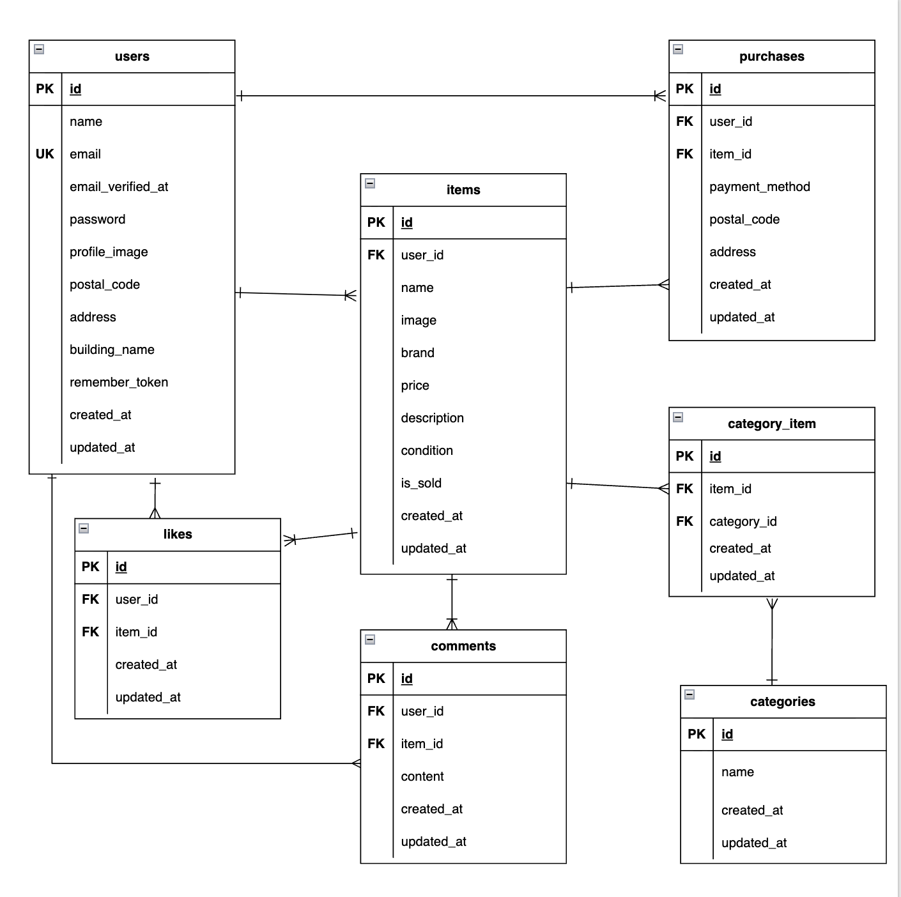

# coachtechフリマ

## 環境構築

### Dockerビルド
```bash
git clone git@github.com:sachimo0411-ctrl/flea-market-app.git
cd flea-market-app
docker compose up -d --build
```

### Laravel環境構築
```bash
docker compose exec php bash
composer install
cp .env.example .env
```

### Laravelセットアップ
```bash
php artisan key:generate
php artisan migrate
php artisan db:seed
```

## 使用技術
- php 8.1-fpm
- Laravel 10.x
- MySQL 8.0.26
- nginx 1.21.1

## ER図


## 機能一覧
- 会員登録 / ログイン / ログアウト
- 商品一覧表示
- 商品詳細表示
- 商品検索機能
- 商品編集機能
- 商品削除機能
- 商品購入機能
- いいね機能
- コメント機能
- プロフィール編集機能

## URL
- 商品一覧画面:http://localhost
- 会員登録画面:http://localhost/register
- ログイン画面:http://localhost/login
- プロフィール画面:http://localhost/mypage
- プロフィール編集画面:http://localhost/mypage/profile
- 商品出品画面:http://localhost/sell
- phpmyadmin:http://localhost:8080

## 工夫した点

### 購入済み商品の再購入防止
購入済み商品には「SOLD OUT」表示を行い、購入ボタンとコメント送信ボタンを無効化することで同じ商品の重複購入を防止しました。

### 出品画像の編集
出品画面では設定された画像を表示できるようにし、「画像を変更する」ボタンから別の画像への変更が出来るようにしました。
ユーザーが現在の設定状態を確認しながら編集できるように意識して実装しました。